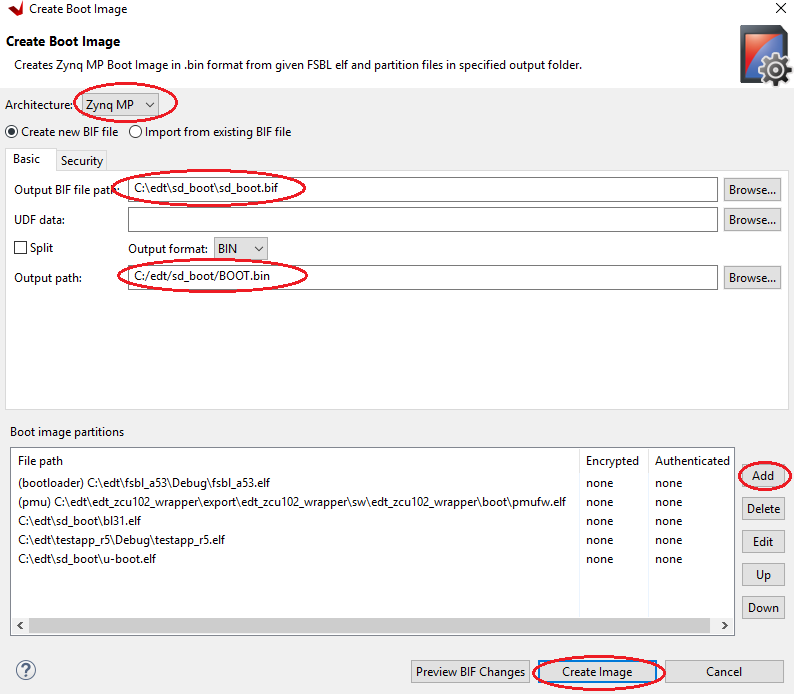
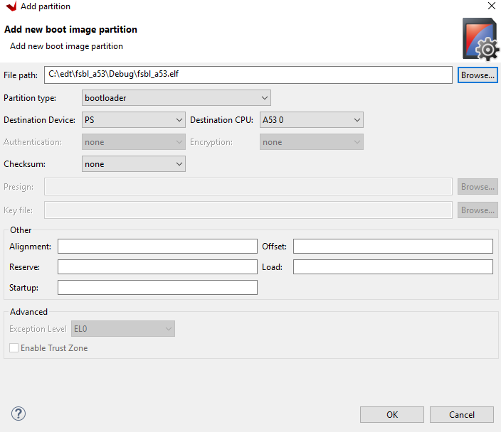
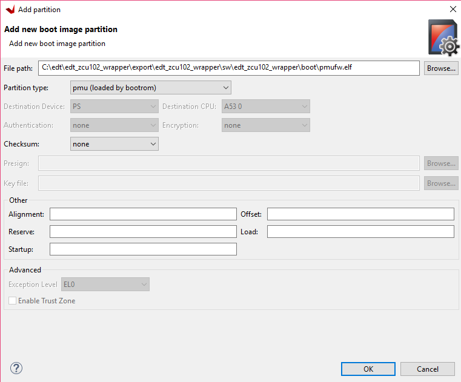
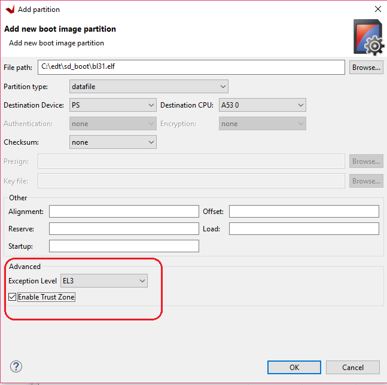
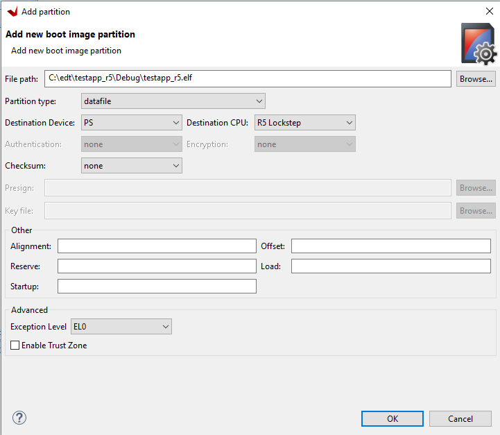
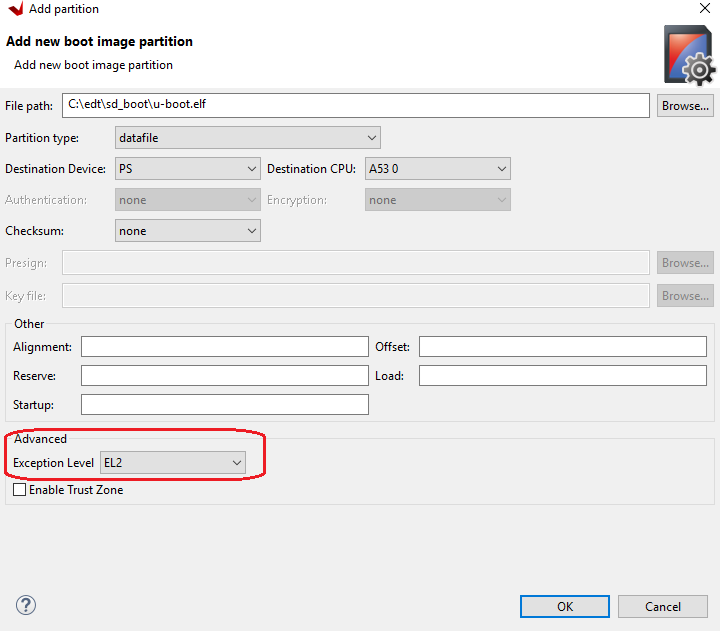

## Boot and Configuration

This chapter shows how to integrate the software and hardware components generated in the previous steps to create a Zynq® UltraScale+™ boot image. After reading this chapter, you will understand how to integrate and load boot loaders, bare-metal applications (for APU/RPU), and the Linux OS for a Zynq UltraScale+ system in different boot requirements: QSPI, SD card, JTAG, and so on.

The following key points are covered in this chapter:
- System software: FSBL, PMU firmware, U-Boot, Trusted Firmware-A (TF-A)
- Application processing unit (APU): configuring SMP Linux for APU
- Real-time processing unit (RPU): configuring bare-metal for RPU in lockstep
- Creating a boot image for the following boot sequence:
  1. APU
  2. RPU lockstep
- Creating and loading a secure boot image

  **Note**
  <table><tr><td>For more information on RPU lockstep, see the Zynq UltraScale+ Device Technical Reference Manual (UG1085).</table></tr></td>

While previous sections focused only on creating software blocks for each processing unit in the PS, this chapter explains how these blocks can be loaded as a part of a bigger system.

To create a boot image, you can either use the Create Boot Image wizard in the Vitis IDE, or the Bootgen command line tool (the Create Boot Image wizard calls the Bootgen tool as well). The principle function of the Create Boot Image wizard or Bootgen is to integrate the partitions (hardware-bitstream and software) in the proper format. It allows you to specify security options. It can also create cryptographic keys.

Functionally, Bootgen uses a BIF (Bootgen image format) file as an input, and generates a single file image in binary BIN or MCS format. It can be used to program non-volatile memories such as QSPI and SD cards. The Bootgen GUI facilitates the creation of the BIF input file.

This chapter makes use of a processing system block. Design Example 1: Using GPIOs, Timers, and Interrupts covers the boot image which will include the PS partitions used in this chapter and a bitstream targeted for the PL fabric.

## System Software

The following system software blocks cover most of the boot and configuration for this chapter. For detailed boot flow and various boot sequences, refer to the System Boot and Configuration chapter in the Zynq UltraScale+ MPSoC: Software Developers Guide (UG1137).

### First Stage Boot Loader

In non-secure boot mode, the platform management unit (PMU) releases the reset of the configuration security unit, and enters the PMU server mode to monitor power. At this stage, the configuration security unit loads the first stage boot loader (FSBL) into on-chip memory (OCM). The FSBL can be run from either APU A53_0, RPU R5_0, or RPU R5_lockstep. In this example, the FSBL is targeted for APU Cortex™-A53 Core 0. The last 512 bytes of this region are used by FSBL to share the hand-off parameters corresponding to the applications handed off by the TF-A.

The first stage boot loader initializes important blocks in the processing subsystem. This includes clearing the reset of the processors and initializing clocks, memory, UART, and so on before handing over the control of the next partition in DDR, to either the RPU or APU. In this example, the FSBL loads a bare-metal application in DDR and hands off to the RPU Cortex-R5F in lockstep mode, and then loads U-Boot to be executed by the APU Cortex-A53 Core-0. For more information, see the Zynq UltraScale+ MPSoC: Software Developers Guide (UG1137).

For this chapter, you can use the FSBL executable that you created in Building Software for PS Subsystems. In the FSBL application, the **xfsbl_translation_table.S** differs from the **translation_table.S** of the Cortex-A53 in only one aspect, to mark the DDR region as reserved. This is to avoid speculative access to DDR memory controller before it is initialized. When the DDR initialization is completed in FSBL, the memory attributes for the DDR region are changed to “memory” so that they are cacheable.

### Platform Management Unit Firmware (PMUFW)

The platform management unit (PMU) and the configuration security unit manage and perform the multi-staged booting process. The PMU primarily controls the pre-configuration stage that executes the PMU ROM to set up the system. The PMU handles all of the processes related to reset and wake-up. The Vitis IDE provides PMU firmware that can be built to run on the PMU. For more details on the platform management and PMU firmware, see the Zynq UltraScale+ MPSoC: Software Developers Guide (UG1137).

The PMU firmware can be loaded in the following ways:

  - Using BootROM as described in Boot Sequence for SD-Boot.
  - Using FSBL as described in Boot Sequence for QSPI Boot Mode.
  - Using JTAG boot mode as described in Boot Sequence for QSPI-Boot Mode Using JTAG.

For more information, see the PMU Firmware Xilinx Wiki.

### U-Boot

The U-Boot acts as a secondary boot loader. After the FSBL handoff, the U-Boot loads Linux on the Arm® Cortex-A53 APU. After FSBL, the U-Boot configures the rest of the peripherals in the processing system based on board configuration. U-Boot can fetch images from different memory sources such as eMMC, SATA, TFTP, SD, and QSPI. For this example, U-Boot and all other images are loaded from the SD card. Therefore, for this example, the board will be set to SD-boot mode.

U-Boot can be configured and built using the PetaLinux tool flow. For this example, you can use the U-Boot image that you created in Building Linux Software for PS Subsystems.

### Trusted Firmware-A (TF-A)

The TF-A is a transparent bare-metal application layer executed in Exception Level 3 (EL3) on the APU. The TF-A includes a Secure Monitor layer for switching between the secure and non-secure world. The Secure Monitor and the implementation of Trusted Board Boot Requirements (TBBR) make the TF-A layer a mandatory requirement to load Linux on an APU on Zynq UltraScale+.

FSBL loads the TF-A to be executed by the APU, which keeps running in EL3 awaiting a service request. The TF-A starts at 0xFFFEA000. FSBL also loads U-Boot in DDR to be executed by the APU, which loads the Linux OS in SMP mode on the APU. It is important to note that the PL bitstream should be loaded before the TF-A is loaded. This is because FSBL uses the OCM region, which is reserved by the TF-A as a temporary buffer for when the bitstream is present in the BIN file. Because of this, if the bitstream is loaded after the TF-A, FSBL overwrites the TF-A image with its temporary buffer, corrupting the TF-A image. The bitstream should therefore be positioned the in BIF before the TF-A and preferably immediately after FSBL and PMU firmware.

The TF-A (**bl31.elf**) is built by default in PetaLinux and can be found in the PetaLinux project images directory.

For more details on TF-A, refer to the Arm Trusted Firmware section in the Security chapter of the Zynq UltraScale+ MPSoC: Software Developers Guide UG1137).

### Linux on APU

You already created the PetaLinux images in Building Software for PS Subsystems. In this example, the PetaLinux is configured to build images for SD-boot with an **initramfs** root file system. This is the default boot setting in PetaLinux.

The images can be found in the **$<PetaLinux_Project>/images/linux/** directory. For loading Linux on the APU, the following images are used from PetaLinux:

  - TF-A: **bl31.elf**
  - U-Boot: **u-boot.elf**
  - Linux images: **image.ub**, which contains:
    - Kernel image: **Image**
    - Device tree blob: **system.dtb**
    - Root file system: **rootfs.cpio.gz.u-boot**
   
### Bare Metal on the RPU

In addition to Linux on APU, this example also loads a bare-metal application on RPU Cortex-R5F in lockstep mode.

For this example, refer to the testapp_r5 application that you created in Creating a Custom Bare-Metal Application for an Arm Cortex-R5F Based RPU in the Same System Project.

### Boot Sequence for SD-Boot

Now that all the individual images are ready, create the boot image to load all of these components on the Zynq UltraScale+ device. This can be done using the Create Boot Image wizard in the Vitis IDE by performing the following steps.

1. Launch the Create Boot Image wizard in the Vitis IDE:
  - In the Vitis IDE, select **Xilinx → Create Boot Image**.
2. Select all the partitions referred to in earlier sections in this chapter, and set them as shown in the following figure.



3. Add the FSBL partition:

  1. In the Create Boot Image wizard, click **Add** to open the Add Partition view.
  2. In the Add Partition view, click **Browse** to select the FSBL executable.
  3. For FSBL, ensure that the partition type is selected as boot loader and the correct destination CPU is selected by the tool. The tool is configured to make this selection based on the FSBL executable.

**Note**
Ignore the Exception Level drop down, because FSBL is set to EL3 by default. Also, leave the TrustZone setting unselected for this example.



  4. Click OK to select FSBL and go back to Create Boot Image wizard.

4. Add the PMU and TF-A firmware partitions:

  1. Click Add to open the Add Partition view, shown in the following figure.



  2. Add the PMU firmware partition.
  3. Browse to and select the **PMU Firmware executable**.
  4. For this partition, select **pmu** as the partition type.
  5. Leave the Exception Level and TrustZone settings unselected.
  6. Click **OK**.
  7. Click **Add** to open the Add Partition view.
  8. Add the TF-A firmware **bl31.elf** partition.

**Note**
TF-A Firmware (**bl31.elf**) can be found in **<PetaLinux Project>/image/linux/**.

  1. For this partition, select **datafile** as the partition type.
  2. Set the Destination Device as **PS**.
  3. Set the Destination CPU as **A53 0**.
  4. Set the Exception Level to EL3 and select **Enable TrustZone**.



  9. Click **OK.**

5. Add the R5 executable and enable it in lockstep mode.

  1. Click Add to add the Cortex-R5F bare-metal executable.

  

  2. Set the Destination Device as **PS**.
  3. Set the Destination CPU as **R5 Lockstep**. This sets the RPU R5 cores to run in lockstep mode.
  4. Leave Exception Level and TrustZone unselected.
  5. Click **OK**.

6. Now, add the U-Boot partition. You can find **u-boot.elf** for sd_boot mode in **<PetaLinux_project>/images/linux/sd_boot**.

  1. Click **Add** to add the u-boot.elf partition.
  2. For U-Boot, select the Destination Device as **PS**.
  3. Select the Destination CPU as **A53 0**.
  4. Set the Exception Level to **EL2**

  

  5. Click **OK** to return to the Create Boot Image wizard.
  6. Click **Create Image** to close the wizard and create the boot image.

You can also create **BOOT.bin** images using the BIF attributes and the Bootgen command. For this configuration, the BIF file contains the following attributes:

```
//arch = zynqmp; split = false; format = BIN
the_ROM_image:
{
[bootloader, destination_cpu = a53-0]C:\edt\fsbl_a53\Debug\fsbl_a53.elf
[pmufw_image]C:\edt\edt_zcu102_wrapper\export\edt_zcu102_wrapper\sw\edt_zcu102_wrapper\boot\pmufw.elf
[destination_cpu = a53-0, exception_level = el-3, trustzone]C:\edt\sd_boot\bl31.elf
[destination_cpu = r5-lockstep]C:\edt\testapp_r5\Debug\testapp_r5.elf
[destination_cpu = a53-0, exception_level = el-2]C:\edt\sd_boot\u-boot.elf
}
```
The Vitis IDE calls the following Bootgen command to generate the BOOT.bin image for this configuration:

`bootgen -image sd_boot.bif -arch zynqmp -o C:\edt\sd_boot\BOOT.bin`


  


  


