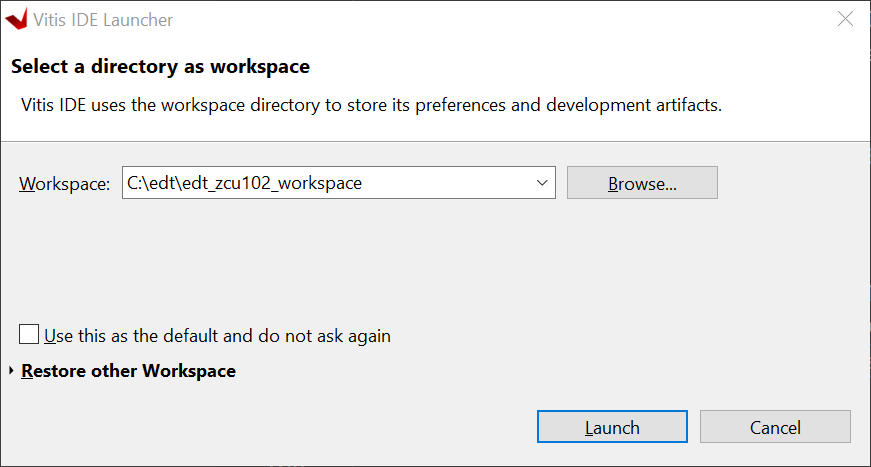
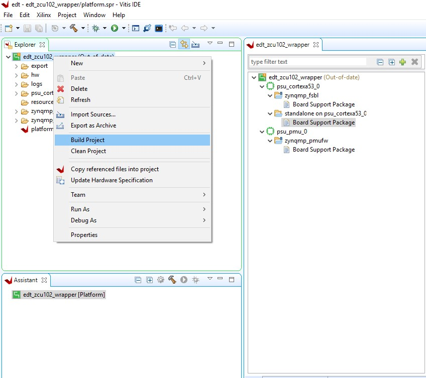
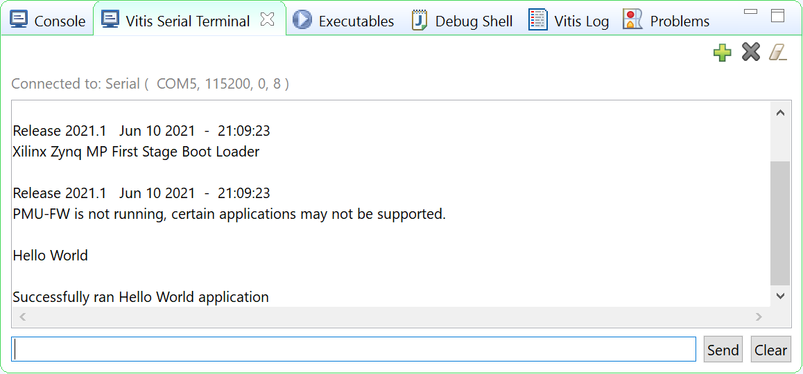

## Building Standalone Software for PS Subsystems

This chapter lists the steps to configure and build software for PS subsystems.

In the previous chapter, [Zynq UltraScale+ MPSoC Processing System Configuration](create_system.md), you created and exported the hardware design from Vivado. The exported XSA file contains the hardware handoff, the processing system initialization (psu_init), and the PL bitstream (if the hardware is exported as post-implementation). In this chapter, you will import the XSA into the Vitis™ IDE to generate software for the processing system.

You will use the Vitis IDE to perform the following tasks:

Create a platform project for the hardware XSA. The first stage boot loader (FSBL) and PMU firmware for the PMU (platform management unit) will be created as boot components in this platform project.

Create bare-metal applications for the application processing unit (APU).

Create a system project for the APU and real time processing unit (RPU).

## Example 2: Creating a Platform Project Using Vitis IDE

In this example, we will create a platform project to extract the information from Vivado exported XSA.

The main processing units in the Zynq UltraScale+ processing system are listed below:

- **Application processing unit**: Quad-core Arm® Cortex™-A53 MPCore processors
- **Real time processing unit**: Dual-core Arm Cortex™-R5F MPCore processors
- **Graphics processing unit**: Arm Mali™ 400 MP2 GPU
- **Platform management unit (PMU)**: Xilinx MicroBlaze™ based platform management unit

The platform project reads in hardware information from the XSA file and contains the runtime environment for the above processing units. Application software can link against the libraries generated in the platform project.

## Example Input and Output Files¶

- Input: hardware handoff XSA file (**edt_zcu111_wrapper.xsa**)
- Output:
  - Standalone BSP libraries for Arm Cortex-A53
  - Boot components (FSBL: **zynqmp.elf** and PMUFW: **pmufw.elf**)
 
## Creating the Platform Project

The following steps show how to create a platform project with a standalone domain for Arm Cortex-A53.

1. Launch the Vitis IDE:

  - From the open Vivado IDE, click Tools → Launch Vitis IDE; or
  - From Windows Start menu, select Xilinx Design Tools → Xilinx Vitis 2021.2; or
  - Double-click the C:\Xilinx\Vitis\2021.2\bin\vitis.bat file.

2. Select the workspace C\edt\edt_zcu102_workspace and continue.

Vitis IDE Launcher

**Note** If the directory doesn’t exist, the Vitis software platform will create it.

3. In the Vitis IDE, go to **File → New → Platform Project.**
4. In the Create New Platform page, enter the platform name **zcu111_edt** and click **Next**.
5. In the Platform view, go with the default tab **Create from hardware specification (XSA).**

**Note** Use the **Select a platform from repository** tab when you have a pre-built platform and you’d like to copy it to local to modify it.

6. Click **Browse…** to select the XSA file exported from previous chapter.
7. Select the preferred operating system, processor, and architecture.

| **Screen**                       | **Property**                 |
|----------------------------------| -----------------------------|
| Operating System                 | Standalone                   |
| Processor                        | psu_cortexa53_0              |
| Architecture                     | 64-bit                       |
| Generate Boot Components         | Keep it checked              |
| Target processor to create FSBL  | psu_cortexa53_0              |

8. Click **Finish.**
9. In a few minutes, the Vitis IDE generates the platform. The files that are generated are displayed in the explorer window as shown in the following figure.

- There is a standalone domain in the platform under psu_cortexa53_0 processor. New applications for Cortex-A53 can link against it.
- Default domains for FSBL and PMU firmware come with the platform project when **Generate Boot Components** is selected during application or platform project creation.
- You are free to add and remove domains in the platform project.
- You can customize the domain configurations.

Build the hardware by right-clicking the platform, then selecting **Build Project.**

The platform project is ready. You can create applications using this platform and test on zcu102 hardware.

**Note** The project build process builds the standalone BSP, FSBL, and PMUFW. FSBL and PMUFW have their own BSP. The build process takes some time.

## Example 3: Running the “Hello World” Application from Arm Cortex-A53

In this example, you will create a “Hello World” application based on the platform created in the previous example. You will learn how to manage the board settings, make cable connections, connect to the board through your PC, and run a simple “Hello World” software application from an Arm Cortex-A53 processor in JTAG mode using the System Debugger in the Vitis IDE.

## Input and Output Files

- Input: standalone BSP libraries in the platform created in the previous example
- Output: hello.elf for Arm Cortex-A53

## Board Setup 

ZCU111 Board Connection Guide

1. Connect the power cable to the board.
2. Connect a USB micro cable between the Linux/Windows host machine and **J2 USB JTAG** connector on the target board.
3. Connect a USB micro cable to connector J83 on the target board with the Windows host machine. This is used for USB to serial transfer.
4. Ensure that the SW6 Switch on the bottom right is set to **JTAG boot mode** as shown in the following figure.

5. Power on the ZCU111 board.

## Connecting the Serial Port

1. Open your preferred serial communication utility for the COM port.
**Note**
You can use any serial communication utility in your system. The Vitis IDE provides a serial terminal utility. We will use it throughout the tutorial; select **Window → Show View → Vitis** Serial Terminal in Vitis IDE to open it.

2. Click the + button to set the serial configuration.

Vitis Terminal Window

3. To find the correct COM port in Windows, verify the port details in the **Device Manager**. In Linux, check the COM port in **/dev**.

MPSoC UART-0 corresponds to the COM port with Interface-0. Windows Device Manager provides mapping between Interface-x and COM-x.

Windows Device Manager

In the above example, use COM5 for Interface-0 and baud rate 115200.

4. From the Port dropdown menu, select the port number for Interface-0 (COM5 in this example).

5. Keep the other settings as-is and click **OK** to connect. The connection status is shown in the Vitis Serial Terminal window.

### Creating a Hello World Application on Arm Cortex-A53

To send the “Hello World” string to the UART0 peripheral, follow these steps:

1. Select **File → New → Application** Project. The Create New Application Project wizard opens.
2. Click **Next**.
3. Use the information in the table below to make your selections in the wizard screens.

| **Screen**                  | **System Properties**            | **Settings                     |
|-----------------------------| ---------------------------------|--------------------------------|
| Platform                    | Select platform from repository  | zcu111_edt                     |
| Application project details | Application project name         | hello_a53                      |
|                             | System project name              | hello_a53_system               |
|                             | Target processor                 | psu_cortexa53_0                |
| Domain                      | Domain                           | standalone on psu_cortexa53_0  |
| Templates                   | Available templates              | Hello World                    |       

The Vitis IDE creates the **hello_a53_system** project in the Explorer view. **hello_a53** sits inside **hello_a53_system**.

### Running Hello World on the Board

1. Right-click the hello_a53 application project and select Build to build the application.
2. Right-click hello_a53 and select Run as → Run Configurations.
3. Right-click Xilinx Application Debugger and click New Configuration.
The Vitis IDE creates the new run configuration, named Debugger_hello_a53-Default.
The configurations associated with the application are pre-populated in the Main page of the launch configurations.
4. Click the Target Setup page to review the settings.

**Note** The board should be in JTAG boot mode before power cycling.

5. Power cycle the board.
6. Click Run.

Hello World appears on the serial communication utility in Terminal 1, as shown in the following figure.

**Note**
No bitstream download is required for the above software application to be executed on the Zynq UltraScale+ evaluation board. The Arm Cortex-A53 quad-core is already present in the processing system. Basic initialization of this system to run a simple application is accomplised by the device initialization Tcl script.

7. Power cycle the board and retain the same connections and board settings for the next section.

### What Just Happened?

The application software sent the “Hello World” string to the UART0 peripheral of the PS section.

From UART0, the “Hello World” string goes byte-by-byte to the serial terminal application running on the host machine, which displays it as a string.

### One Step Further

Could you create a “Hello World” application for Arm Cortex-R5F and launch it though JTAG?

**Tip**
1. In the platform project, you will need to create a domain for the Arm Cortex-R5 processor.
2. In the New Project Wizard, remember to select the proper target processor.

The full workflow is explained in the next example.

## Additional Information

See below for definitions of some of the terms used in this chapter.

### Domain

A domain can refer to the settings and files of a standalone BSP, a Linux OS, a third-party OS/BSP such as FreeRTOS, or a component such as the device tree generator.

You can create multiple applications to run on the domain. A domain is tied to a single processor or a cluster of isomorphic processors (for example: A53_0 or A53) in the platform.

### Board Support Package¶
The board support package (BSP) is the support code for a given hardware platform or board that helps in basic initialization at power-up and helps software applications to be run on top of it. It can be specific to some operating systems with boot loader and device drivers.

**Tip**
To reset the BSP source, double-click **platform.prj**, select a BSP in a domain, and click **Reset BSP Source**. This action only resets the source files while settings are not touched. To change the target domain after application project creation, double-click the **project.prj** file in Explorer view. In the Application Project Settings, select **Domain → Domain change option → Drop-down Domain**, then select the available domains for this application.

### Standalone BSP
Standalone is a simple, low-level software layer. It provides access to basic processor features such as caches, interrupts, and exceptions, as well as the basic processor features of a hosted environment. These basic features include standard input/output, profiling, abort, and exit. It is a single-threaded semi-hosted environment.

