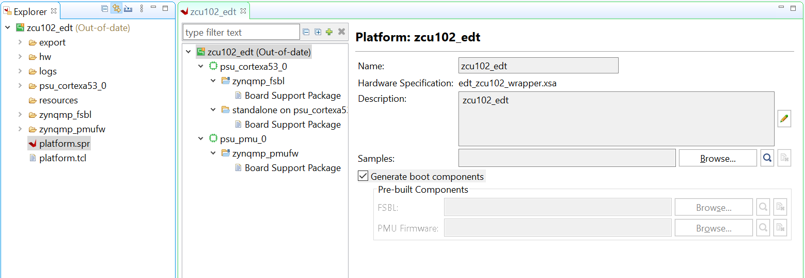

## Building Standalone Software for PS Subsystems

This chapter lists the steps to configure and build software for PS subsystems.

In the previous chapter, [Zynq UltraScale+ MPSoC Processing System Configuration](create_system.md), you created and exported the hardware design from Vivado. The exported XSA file contains the hardware handoff, the processing system initialization (psu_init), and the PL bitstream (if the hardware is exported as post-implementation). In this chapter, you will import the XSA into the Vitis™ IDE to generate software for the processing system.

You will use the Vitis IDE to perform the following tasks:

Create a platform project for the hardware XSA. The first stage boot loader (FSBL) and PMU firmware for the PMU (platform management unit) will be created as boot components in this platform project.

Create bare-metal applications for the application processing unit (APU).

Create a system project for the APU and real time processing unit (RPU).

## Example 2: Creating a Platform Project Using Vitis IDE

In this example, we will create a platform project to extract the information from Vivado exported XSA.

The main processing units in the Zynq UltraScale+ processing system are listed below:

- **Application processing unit**: Quad-core Arm® Cortex™-A53 MPCore processors
- **Real time processing unit**: Dual-core Arm Cortex™-R5F MPCore processors
- **Graphics processing unit**: Arm Mali™ 400 MP2 GPU
- **Platform management unit (PMU)**: Xilinx MicroBlaze™ based platform management unit

The platform project reads in hardware information from the XSA file and contains the runtime environment for the above processing units. Application software can link against the libraries generated in the platform project.

## Example Input and Output Files¶

- Input: hardware handoff XSA file (**edt_zcu111_wrapper.xsa**)
- Output:
  - Standalone BSP libraries for Arm Cortex-A53
  - Boot components (FSBL: **zynqmp.elf** and PMUFW: **pmufw.elf**)
 
## Creating the Platform Project

The following steps show how to create a platform project with a standalone domain for Arm Cortex-A53.

1. Launch the Vitis IDE:

  - From the open Vivado IDE, click Tools → Launch Vitis IDE; or
  - From Windows Start menu, select Xilinx Design Tools → Xilinx Vitis 2021.2; or
  - Double-click the C:\Xilinx\Vitis\2021.2\bin\vitis.bat file.

2. Select the workspace C\edt\edt_zcu102_workspace and continue.

Vitis IDE Launcher

**Note** If the directory doesn’t exist, the Vitis software platform will create it.

3. In the Vitis IDE, go to **File → New → Platform Project.**
4. In the Create New Platform page, enter the platform name **zcu111_edt** and click **Next**.
5. In the Platform view, go with the default tab **Create from hardware specification (XSA).**

**Note** Use the **Select a platform from repository** tab when you have a pre-built platform and you’d like to copy it to local to modify it.

6. Click **Browse…** to select the XSA file exported from previous chapter.
7. Select the preferred operating system, processor, and architecture.

| **Screen**                       | **Property**                 |
|----------------------------------| -----------------------------|
| Operating System                 | Standalone                   |
| Processor                        | psu_cortexa53_0              |
| Architecture                     | 64-bit                       |
| Generate Boot Components         | Keep it checked              |
| Target processor to create FSBL  | psu_cortexa53_0              |

8. Click **Finish.**
9. In a few minutes, the Vitis IDE generates the platform. The files that are generated are displayed in the explorer window as shown in the following figure.

- There is a standalone domain in the platform under psu_cortexa53_0 processor. New applications for Cortex-A53 can link against it.
- Default domains for FSBL and PMU firmware come with the platform project when **Generate Boot Components** is selected during application or platform project creation.
- You are free to add and remove domains in the platform project.
- You can customize the domain configurations.

Build the hardware by right-clicking the platform, then selecting **Build Project.**

The platform project is ready. You can create applications using this platform and test on zcu102 hardware.

**Note** The project build process builds the standalone BSP, FSBL, and PMUFW. FSBL and PMUFW have their own BSP. The build process takes some time.

