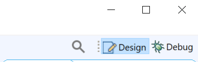

## Debugging Standalone Applications with the Vitis Debugger

This chapter describes debug possibilities with the design flow you have already been working with. The first option is debugging with software using the Vitis™ debugger.

The Vitis debugger provides the following debug capabilities:

- Debugging of programs on Arm® Cortex™-A53, Arm® Cortex™-R5F, and MicroBlaze™ processor architectures (heterogeneous multi-processor hardware system debugging)
- Debugging of programs on hardware boards
- Debugging on remote hardware systems
- A feature-rich IDE to debug programs
- A Tool Command Language (Tcl) interface for running test scripts and automation

The Vitis debugger enables you to see what is happening to a program while it executes. You can set breakpoints or watchpoints to stop the processor, step through program execution, view the program variables and stack, and view the contents of the memory in the system.

The Vitis debugger supports debugging through Xilinx® System Debugger.

## Xilinx System Debugger

The Xilinx System Debugger uses the Xilinx hardware server as the underlying debug engine. The Vitis IDE translates each user interface action into a sequence of Target Communication Framework (TCF) commands. It then processes the output from System Debugger to display the current state of the program being debugged. It communicates to the processor on the hardware using Xilinx hardware server.

The debug workflow is described in the following figure.

The workflow is made up of the following components:

- **Executable ELF File**: To debug your application, you must use an executable and linkable format (ELF) file compiled for debugging. The debug ELF file contains additional debug information for the debugger to make direct associations between the source code and the binaries generated from that original source. To manage the build configurations, right-click the software application and select **Build Configurations → Manage**.
- **Debug Configuration**: To launch the debug session, you must create a debug configuration in the Vitis debugger. This configuration captures the options required to start a debug session, including the executable name, processor target to debug, and other information. To create a debug configuration, right-click your software application and select **Debug As → Debug Configurations**.
- **Vitis Debug Perspective**: Using the Debug perspective, you can manage the debugging or running of a program in the workbench. You can control the execution of your program by setting breakpoints, suspending launched programs, stepping through your code, and examining the contents of variables. To view the Debug Perspective, select **Window → Open Perspective → Debug**.

You can repeat the cycle of modifying the code, building the executable, and debugging the program in the Vitis debugger.

**Note**
If you edit the source after compiling, the line numbering will be out of step because the debug information is tied directly to the source. Similarly, debugging optimized binaries can also cause unexpected jumps in the execution trace.

## Example 6: Debugging Software Using the Vitis Debugger

In this example, you will walk through debugging a “Hello World” application.

**Note**
If you did not create a “Hello World” application on the APU or RPU, follow the steps in creating-a-custom-bare-metal-application-for-an-arm-cortex-a53-based-apu to create a new “Hello World” application.

After you create the “Hello World” application, work through the following example to debug the software using the Vitis debugger.

1. Connect the JTAG cable, set the boot mode to JTAG, and power on the board. Refer to the steps in Example 3: Running the “Hello World” Application from Arm Cortex-A53.
2. In the C/C++ Perspective, right-click the hello_a53 Project and select **Debug As→ Launch on Hardware → Single Application Debug**.

**Note**
The above step launches the Application Debugger in the Debug perspective based on the project settings. Alternatively, you can create a debug configuration which looks like the following figure.

Debug Configurations

**Note**
The contents of Debug Configurations are identical to those in Run Configurations. The difference between run and debug is that debug stops at the main() function by default.

If the Confirm Perspective Switch popup window appears, click Yes. The Debug perspective opens.

**Note**
If the Debug perspective window does not open automatically, select **Window→ Perspective → Open Perspective → Other**, then select **Debug** in the Open Perspective wizard. You can quickly switch between Design Perspective and Debug Perspective with buttons on upper right corner.

**Note**
The addresses shown on this page might slightly differ from the addresses shown on your system.

The processor is currently sitting at the beginning of main() with program execution suspended at line 0000000000000cf0. You can confirm this information in the Disassembly view, which shows the assembly-level program execution also suspended at 0000000000000cf0.

**Note**
If the Disassembly view is not visible, select **Window→Show View→ Disassembly**.

3. The helloworld.c window also shows execution suspended at the first executable line of C code. Select the **Registers** view to confirm that the program counter, pc register, contains 0000000000000cf0.
**Note**
If the Registers window is not visible, select **Window → Show View → Registers**.

4. Double-click in the margin of the helloworld.c window next to the line of code that reads print (“Hello World”);. This sets a breakpoint at the printf command. To confirm the breakpoint, review the Breakpoints window.
**Note**
If the Breakpoints window is not visible, select **Window → Show View → Breakpoints**.

5. Select **Run → Step Into (F5)** to step into the init_platform() routine.

Program execution suspends at location 0000000000000d3c. The call stack is now two levels deep.

6. Select **Run → Resume (F8)** to continue running the program to the breakpoint.

Program execution stops at the line of code that includes the printf command. The Disassembly and Debug windows both show program execution stopped at 0000000000001520.

**Note**
The execution address in your debugging window might differ if you modified the “Hello World” source code in any way.

7. Select **Run → Resume (F8)** to run the program to conclusion.

When the program completes, the Debug window shows that the program is suspended in a routine called exit. This happens when you are running under control of the debugger.

8. Rerun your code several times. Experiment with single-stepping, examining memory, breakpoints, modifying code, and adding print statements. Try adding and moving views.
**Tip**
You can use the Vitis debugger debugging shortcuts for step-into (F5), step-return (F7), step-over (F6), and resume (F8).

## Example 7: Debugging Using XSCT

You can use the previous steps to debug bare-metal applications running on RPU and PMU using the Vitis application debugger GUI.

Additionally, you can debug in command line mode using XSDB, which is encapsulated as a part of XSCT. In this example, you will debug the bare-metal application testapp_r5 using XSCT.

The following steps indicate how to load a bare-metal application on R5 using XSCT. This example demonstrates the command line debugging capability of XSDB/XSCT. Based on your requirements, you can choose to debug the code using either the System Debugger GUI or the command line debugger in XSCT. All XSCT commands are scriptable, and this also applies to the commands covered in this example.

### Setting Up the Target

