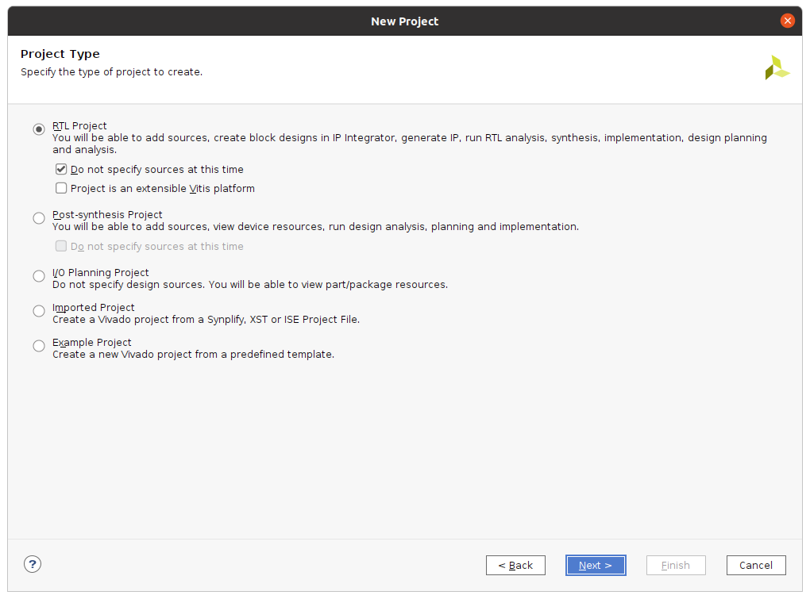
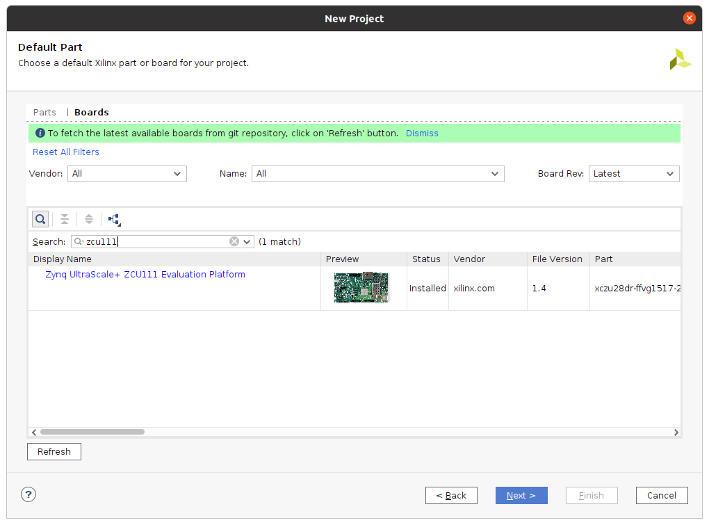
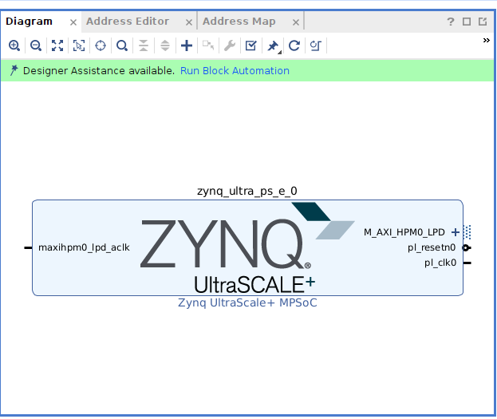
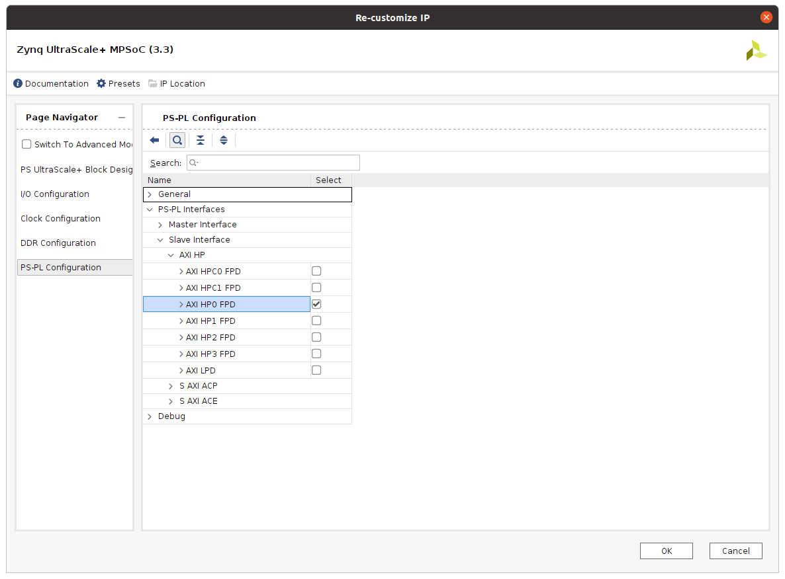
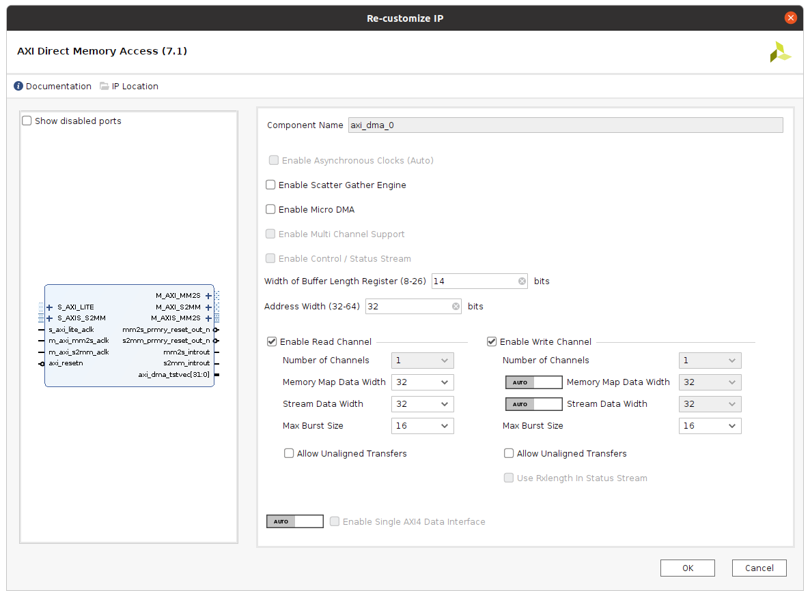
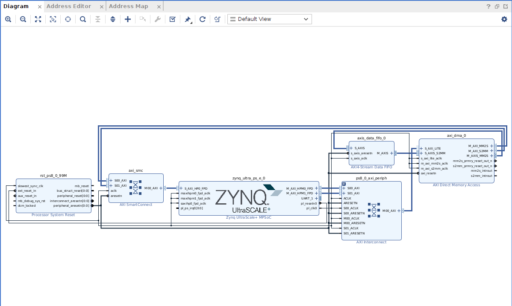
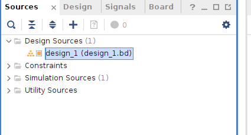
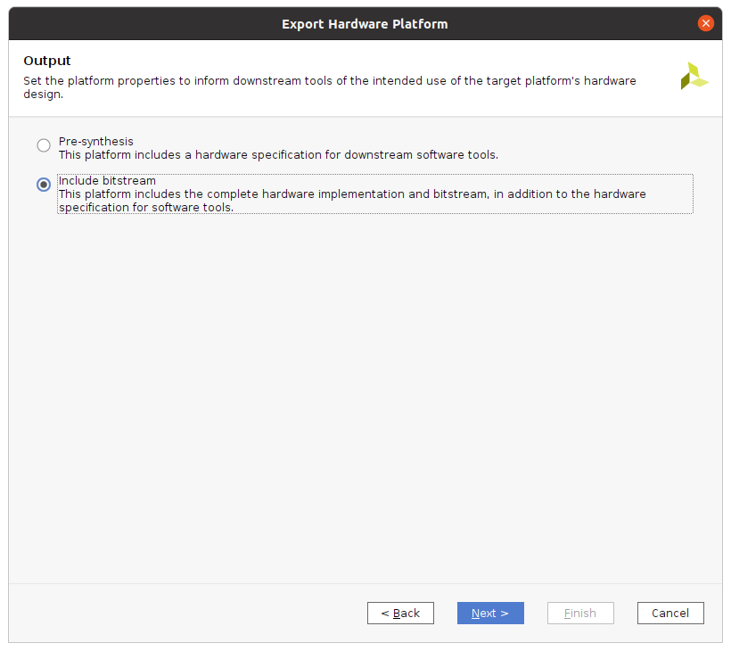
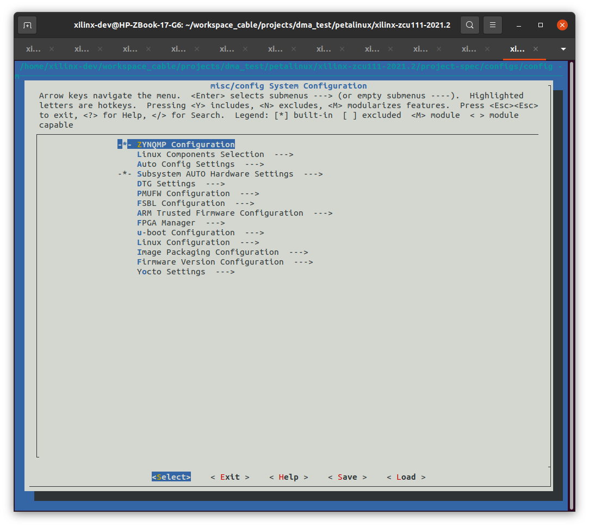

# DMA Project

### Hardware components
AMD ZCU111 board

### Software apps
AMD Xilinx Vivado 2021.2

# Create New Vivado Project

Launch Vivado and select the option to create a new project. Give it the desired name and specify the desired file path in the first few windows that pop up. One of the windows will ask what project type is being created. This is a basic RTL Project being created that is not an extensible Vitis platform, meaning that it is not a project targeting accelerated applications and the specialized components such as the specific kernel they require. Therefore leave the **Project is an extensible Vitis platform** box unchecked. Unless you have RTL files (Verilog or VHDL files) ready to import into the project already, check the box Do not specify sources at the time.

Switch to the **Boards** tab in the **Default Part** window and search for the key term **zcu111**

# Create Block Design

Once the new project has been generated, the first step is to create a new block design. Select the **Create Block Design** option from the Flow Navigator window on the left of the Vivado window.

After the blank block design generates, click the **+** symbol in the middle and type zynq into the search bar of the window that appears. Double-click on the Zynq UltraScale+ MPSoC option that pops up to add the hooks to access the Zynq ARM processor that is physically instantiated in the programable logic of the FPGA.

Once the Zynq processing system IP block appears in the block design, a banner will appear across the top with the option to Run Block Automation. Click on this link and a window will appear specifying the actions of what running block automation will do. In this case, it is applying the board presets for the ZCU111. Click OK, and wait for the block automation to complete.

In the Zynq UltraScale+ MPSoC IP block under PS-PL Configuration, enable one of the AXI high performance slave interface. This is the interface that the AXI DMA will use to access the DDR (main system memory) of the ZCU111.

Zynq UltraScale+ MPSoC configuration window (double-click on Zynq UltraScale+ MPSoC IP to open)

Next, add an instance of the AXI Direct Memory Access IP block to the Vivado block design. Double-click on it to open the configuration window and uncheck the box next to **Enable Scatter Gather Engine**. This will automatically uncheck the box next to Enable Control / Status Stream as well. 

The rest of the default options can be left for the AXI DMA IP. Click OK to close the configuration window.

Click the option to **Run Connection Automation** that appears in the green banner across the top of the block design window. Check the box for **All Automation** and click **OK**.

With the AXI DMA now added and connected to the Zynq UltraScale+ MPSoC, the AXI Stream ports M_AXIS_MM2S and S_AXIS_S2MM can either be connected directly to each other, or a peripheral equipped with the AXI Stream interface can been connected between them.

For this project we will connect an AXI Stream Data FIFO IP block, connecting its S_AXIS port to M_AXIS_MM2S and its M_AXIS port to S_AXIS_S2MM.

*Block diagram in Vivado with AXI DMA and AXI stream data FIFO.*

Validate the block design and save it. Then generate or regenerate an HDL wrapper for it by right-clicking on the block design in the Sources window and selecting the option to Create HDL Wrapper...

In the resulting pop-up window, select the option **Let Vivado manage wrapper and auto-update**.

Once the Sources window shows that Vivado is finished updating the project file structure (the word Updating... disappears from the upper right corner of the window) run synthesis, implementation, and generate a new bitstream (selecting **Generate Bitstream** will run synthesis and implementation). After a new bitstream has been generated, export the hardware for use in PetaLinux by selecting **File > Export > Export Hardware...**

Select the option to include the bitstream in the exported hardware platform and specify the desired output file path. As the default you can use the main project folder for the respective Vivado project. The final screen in the pop-up window will summarize your selections for verification. Click **Finish** to export the hardware as the Xilinx filetype .XSA

# Create PetaLinux Project

Start by sourcing the PetaLinux tools to your environment:

`$ source /<PetaLinux install directory>/2021.2/settings.sh`

Create/change directories into the desired path for the PetaLinux project, then run the following command to create the PetaLinux project:

`$ petalinux-create -t project -s <xilinx-zcu111-v2021.2-final.bsp>`

This should create a **xilinx-zcu111-2021.2** folder. Change into this directory to start configuring it.

`$ cd ./xilinx-zcu111-2021.2`

Import the new hardware design into the project with the following command:

`$ petalinux-config --get-hw-description /<directory of .XSA file>/`

This command pulls the hardware design into the PetaLinux project and launches the System configuration GUI for you to specify hardware configurations. For this project we are not making any other changes to the hardware in the PetaLinux outside of importing the new hardware design that now has the AXI DMA in it. Toggle to select **E** to exit if you have made no changes, **S** if you have made changes you want to save.

*System configuration GUI*

# Create Custom Application in PetaLinux

This project will be demonstrating how to use AXI DMA from the OS/application layer in Linux using memory mapping. A custom application needs to be added to the PetaLinux project with the following command:

`$ petalinux-create -t apps --template c --name dmatest --enable`

The --enable flag at the end simply saves you the step of having to manually add the application to be included in the next PetaLinux build using the root filesystem configuration ASCII GUI.

Open dmatest.c from **./project-spec/meta-user/recipes-apps/dmatest/files** and add the code to it from this [dmatest.c](source/dmatest.c).

# Build PetaLinux Project

After adding the code to run the AXI DMA to the custom application, first build or rebuild the root filesystem.

`$ petalinux-build -c rootfs`

Then build or rebuild the whole PetaLinux project.

`$ petalinux-build`

After the PetaLinux project has built, generate the boot binary for the resultant embedded Linux image with the following command. Note that the force flag is needed if you have previously generated a boot binary for the PetaLinux project.

`$ petalinux-package --boot --fsbl ./images/linux/zynq_fsbl.elf --fpga ./images/linux/system.bit --u-boot --force`

