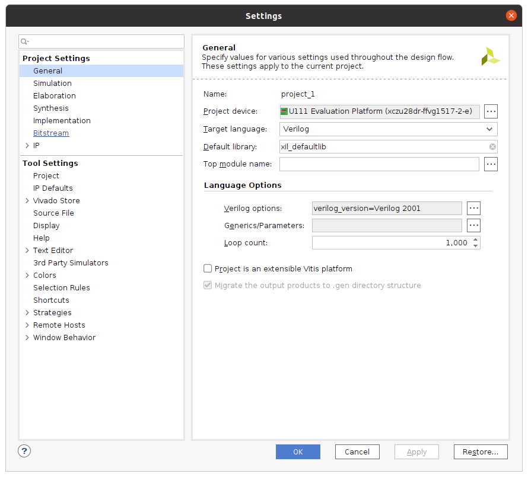

# DMA Project

### Hardware components
AMD ZCU111 board

### Software apps
AMD Xilinx Vivado 2021.2

# Create New Vivado Project

Launch Vivado and select the option to create a new project. Give it the desired name and specify the desired file path in the first few windows that pop up. One of the windows will ask what project type is being created. This is a basic RTL Project being created that is not an extensible Vitis platform, meaning that it is not a project targeting accelerated applications and the specialized components such as the specific kernel they require. Therefore leave the **Project is an extensible Vitis platform** box unchecked. Unless you have RTL files (Verilog or VHDL files) ready to import into the project already, check the box Do not specify sources at the time.

Switch to the **Boards** tab in the **Default Part** window and search for the key term **zcu111**

# Create Block Design

Once the new project has been generated, the first step is to create a new block design. Select the **Create Block Design** option from the Flow Navigator window on the left of the Vivado window.

After the blank block design generates, click the **+** symbol in the middle and type zynq into the search bar of the window that appears. Double-click on the Zynq UltraScale+ MPSoC option that pops up to add the hooks to access the Zynq ARM processor that is physically instantiated in the programable logic of the FPGA.

Once the Zynq processing system IP block appears in the block design, a banner will appear across the top with the option to Run Block Automation. Click on this link and a window will appear specifying the actions of what running block automation will do. In this case, it is applying the board presets for the ZCU111. Click OK, and wait for the block automation to complete.

In the Zynq UltraScale+ MPSoC IP block under PS-PL Configuration, enable one of the AXI high performance slave interface. This is the interface that the AXI DMA will use to access the DDR (main system memory) of the ZCU111.

Zynq UltraScale+ MPSoC configuration window (double-click on Zynq UltraScale+ MPSoC IP to open)

