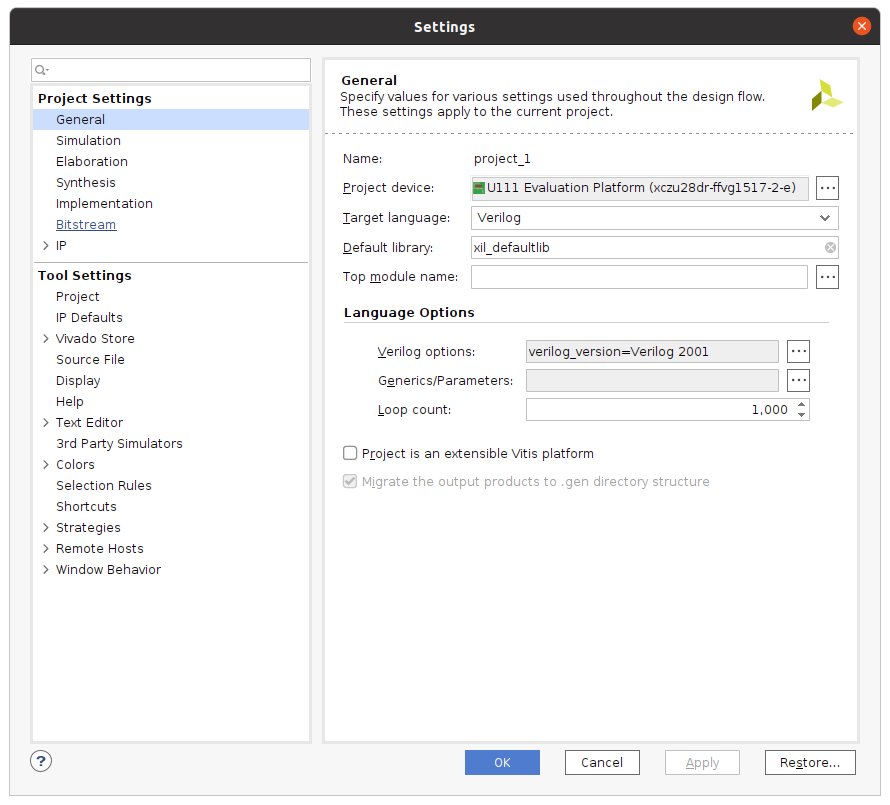
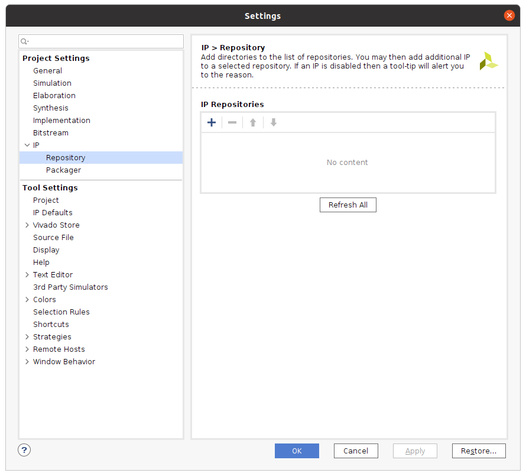
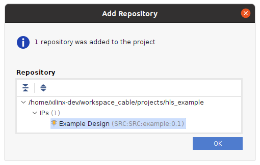
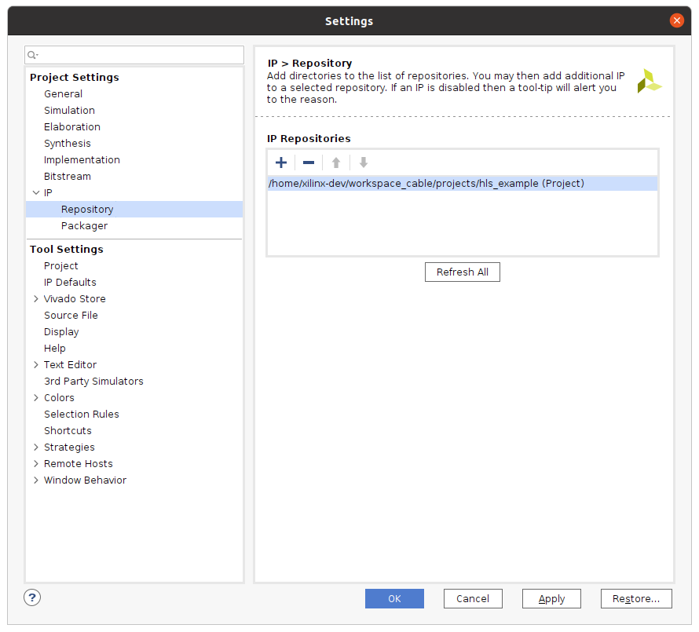
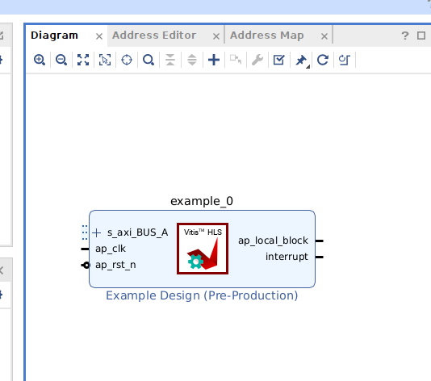

# Basic HLS Example Tutorial

Download the hls_example folder onto your development machine.

Run the following command:

`vitis_hls -f run_hls.tcl`

This command will run RTL synthesis, simulation, implementation and package the design into an IP format.

# Validate IP package in Vivado

In the same directory execute the following command to open up Vivado:

`vivado`

1. Select **Create Project** and keep selecting **Next** until you get to the **Default Part** window. On this window select **Boards** and search for **zcu111** and select this board. Select **Next** and then **Finish** to exit.

Under **Project Manager** select **Settings** and the following window should be displayed.

Select **IP->Repository** and then click the **+"" to add the hls_example folder that contains the example IP package.

Select the **Example Design** repository and click **OK** in this window. 

In the **Settings** window it will show that you have added this folder as an IP repository. Select **OK** to exit from this window.

Now select **Create Block Design** under **IP Integrator**. when the **Generate Block Design** pops up just use the default settings and select **OK**.

In the **Diagram** window select the **+** button and then search for **Example Design**. If everything was generated and added correctly you should see a match. Select the Example Design IP and it will be added to your block diagram.

