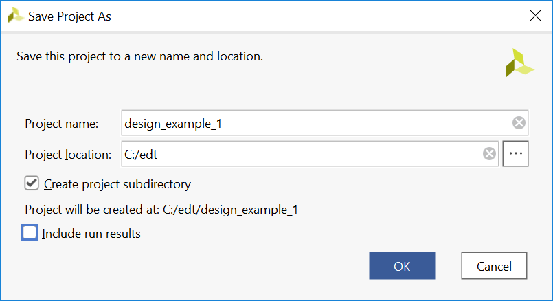

## Design Example 1: Using GPIOs, Timers, and Interrupts

The Zynq® UltraScale+™ MPSoC ZCU102 evaluation board comes with a few configurable switches and LEDs. This design example makes use of bare-metal and Linux applications to toggle these LEDs, with the following details:

  - The Linux APU runs Linux, while the RPU R5-0 hosts another bare-metal application.
  - The Linux applications configure a set of PL LEDs to toggle using a PS dip switch, and another set of PL LEDs to toggle using a PL Dip Switch (SW17).
  - The R5-Core 0 application uses an AXI Timer IP in the programmable logic to toggle PS LED (DS50). The application is configured to toggle the LED state every time the timer counter expires, and the timer in the PL is set to reset periodically after a configurable time interval.
  - The system is configured so that the APU Linux application and RPU bare-metal application run simultaneously.

### Configuring Hardware 

The first step in this design is to configure the PS and PL sections. This can be done in Vivado® IP integrator. Start with adding the required IPs from the Vivado IP catalog, and then connect the components to blocks in the PS subsystem.

1. If the Vivado Design Suite is already open, start from the block diagram shown in and jump to step 4.

2. Open the Vivado project that you created in the introduction tutorial:

  C:/edt/edt_zcu102/edt_zcu102.xpr

3. Save the project as design_example_1:

    1. Click File → Project → Save As.
    2. Input project name design_example_1.
    3. Deselect Include run results.
    4. Click OK.
  

