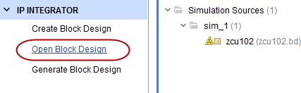
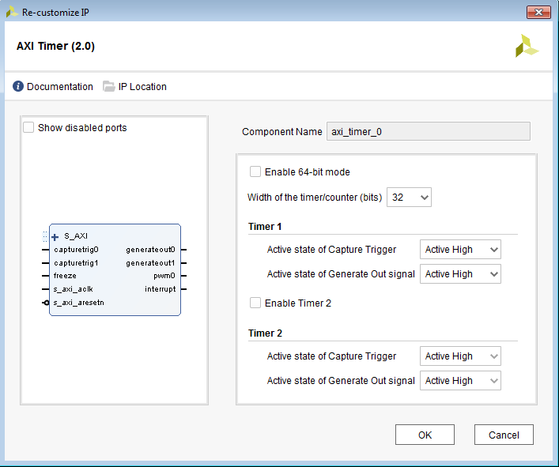
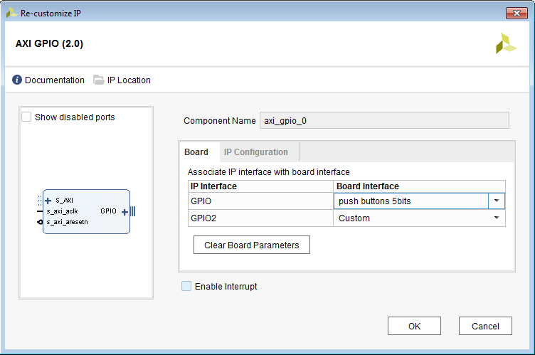
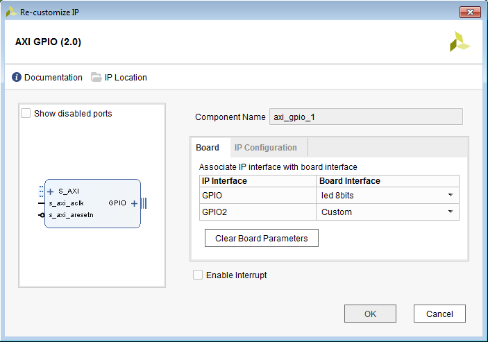
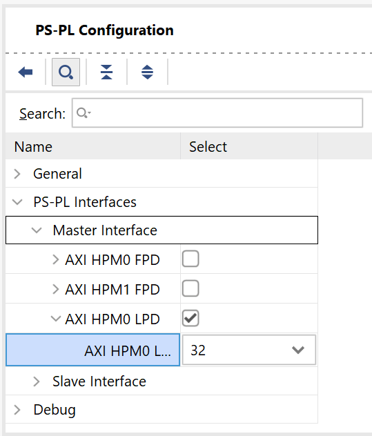
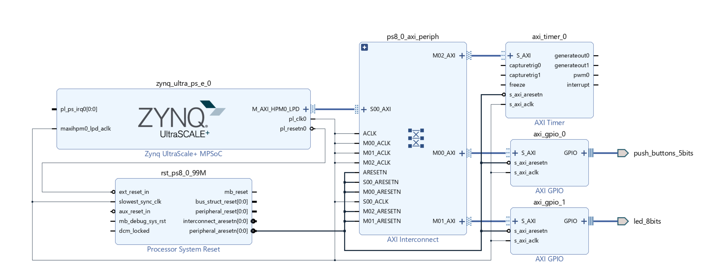
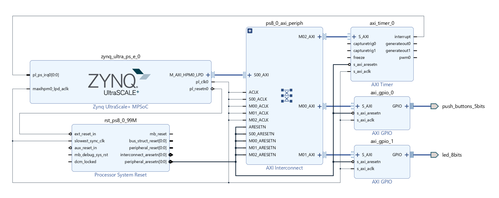
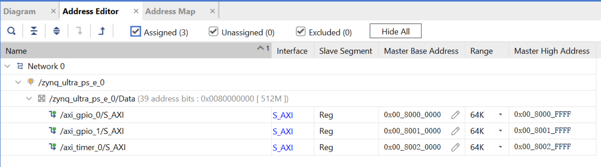
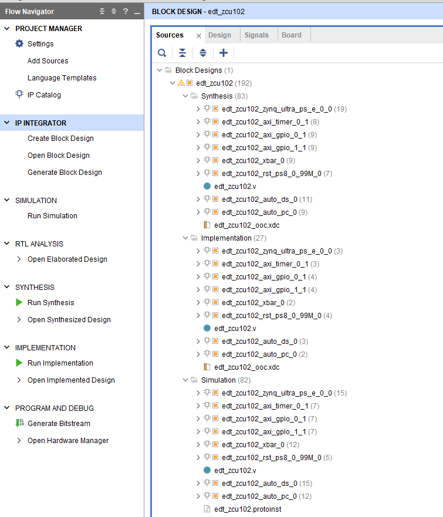
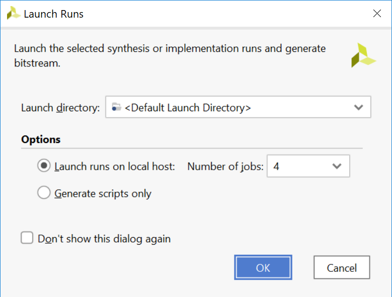

## Design Example 1: Using GPIOs, Timers, and Interrupts

The Zynq® UltraScale+™ MPSoC ZCU102 evaluation board comes with a few configurable switches and LEDs. This design example makes use of bare-metal and Linux applications to toggle these LEDs, with the following details:

  - The Linux APU runs Linux, while the RPU R5-0 hosts another bare-metal application.
  - The Linux applications configure a set of PL LEDs to toggle using a PS dip switch, and another set of PL LEDs to toggle using a PL Dip Switch (SW17).
  - The R5-Core 0 application uses an AXI Timer IP in the programmable logic to toggle PS LED (DS50). The application is configured to toggle the LED state every time the timer counter expires, and the timer in the PL is set to reset periodically after a configurable time interval.
  - The system is configured so that the APU Linux application and RPU bare-metal application run simultaneously.

### Configuring Hardware 

The first step in this design is to configure the PS and PL sections. This can be done in Vivado® IP integrator. Start with adding the required IPs from the Vivado IP catalog, and then connect the components to blocks in the PS subsystem.

1. If the Vivado Design Suite is already open, start from the block diagram shown in and jump to step 4.

2. Open the Vivado project that you created in the introduction tutorial:

  C:/edt/edt_zcu102/edt_zcu102.xpr

3. Save the project as design_example_1:

    1. Click File → Project → Save As.
    2. Input project name design_example_1.
    3. Deselect Include run results.
    4. Click OK.
  

4. In the Flow Navigator, under IP integrator, click **Open Block Design** and select **edt_zcu102.bd**.

## Adding the AXI Timer and AXI GPIO IP

1. Adding the AXI Timer IP:

  1. Right-click in the block diagram and select Add IP from the IP catalog.
  2. In the catalog, select AXI Timer. The IP Details information displays, as shown in the following figure.

  3. Double-click the AXI Timer IP to add it to the design.

2. Review the AXI Timer configurations:

  1. Double-click the AXI Timer IP block to configure the IP, as shown in following figure.

  2. Click **OK** to close the window.

3. Add the **AXI GPIO** IP:

  1. Right-click in the block diagram and select **Add IP**.
  2. Search for “AXI GPIO” and double-click the **AXI GPIO** IP to add it to the design.

4. Add the second **AXI GPIO** IP:

  1. Copy the **axi_gpio_0** IP by typing **Ctrl+C**.
  2. Paste it by typing **Ctrl+V**.
  3. You can see that axi_gpio_1 is created.

5. Configure **axi_gpio_0** for push buttons:

  1. Double-click **axi_gpio_0** to open its configurations.
  2. Select **Push button 5bits** from the Board Interface drop-down list on the GPIO row.
  3. Click **OK**.

6. Configure axi_gpio_1 for PL LEDs:

  1. ouble-click axi_gpio_1 to open its configurations.
  2. Select led_8bits from the Board Interface drop-down list on the GPIO row.
  3. Click OK.

## Connecting IP Blocks to Create a Complete System

The next step is to connect the IP blocks instantiated above to the PS block.

- Use PS HPM LPD AXI to control the AXI interface of the GPIO and timer.
- Connect interrupt signals.

1. Enable the PS AXI HPM LPD AXI interface:

  1. Double-click the **Zynq UltraScale+ MPSoC** IP block.
  2. Select the **PS-PL Configuration** tab.
  3. Enable **AXI HPM0 LPD**, expand it, and set the AXI HPM0 LPD Data Width drop-down to **32** bits.
  4. Click **OK** to close the window.
  5. Check that the M_AXI_HPM0_LPD interface shows up on the MPSoC block.

AXI HPM LPD

**Note**
32-bit AXI is useful for accessing the control registers of general IPs. 128-bit AXI is useful for data transfer.

2. Connect the AXI interfaces:

  1. Click **Run Connection Automation**.
  2. Check **All Automation**.
  3. Go through each tab to review the planning connections.
  4. Click **OK** to execute the automated connection.
  5. Check the connection result.

Vivado Connection Automation Result

3. Connect the interrupt signals:

  1. Connect axi_timer_0.interrupt to zynq_ultra_ps_e_0.pl_ps_irq0[0:0].
  2. The AXI GPIO interrupt mode will not be used.
  3. Review the final block diagram.

Final Block Diagram

**Note**
If you have multiple interrupt signals to connect to the PS, you can concatenate them to a bus with a concat block. You can add concat from **Add IP**.

4. Verify the address settings of IP cores:

In the Address Editor view, verify that the corresponding IPs are assigned addresses during connection automation. If they are not assigned, click the **Assign All** button to assign addresses for them.

**Note**
Connection automation assigns addresses automatically. If you connect IP manually, you also need to assign its address.

### Exporting the Post-Implementation Hardware Platform

We will run implementation of the Vivado design and export the post-implementation design. The Vivado generated bitstream will be included in the XSA file. It can make the software tests and boot image generation steps easier in the Vitis IDE. Note that the Vitis IDE also accepts pre-synthesis XSAs for application development. Bitstream is only required for debugging PL designs.

1. Validate the block diagram design:

  1. Return to the block diagram view.
  2. Save the block design (press **Ctrl+S**).
  3. Click the **Validate Design** button on the block diagram toolbar. Alternatively, press the **F6** key.

  It takes a while to validate the design. A message dialog box pops up and states “Validation successful. There  
  are no errors or critical warnings in this design.” If it reports any errors or critical warnings, review the     previous steps and correct the errors.

  4. Click **OK** to close the message.

2. Generate output products:

  1. Click **Generate Block Design** in the Flow Navigator panel.
  2. Click **Generate**.
  3. When the Generate Output Products process completes, click **OK**.
  4. In the Block Diagram Sources window, click the **IP Sources** tab. Here you can see the output products that you just generated, as shown in the following figure.

3. Make sure you have an HDL top file. Because this design is saved from the introduction design, we have already done it.
4. Run synthesis, implementation, and bitstream generation:

  1. Click **Generate Bitstream**.
  2. Vivado displays a popup message saying “There are no implementation results available. OK to launch synthesis and implementation?”. Click **Yes**.
  3. Review the **Launch Runs** dialogue, set the proper number of jobs to run simultaneously, and click **OK**.
  4. Wait for Vivado to complete implementation. After it finishes, a Bitstream Generation Completed message will pop up. Click **Cancel** to close it.

Vivado Launch Run Configuration

5. Export the hardware design:

  1. Select **File → Export → Export Hardware**. The Export Hardware Platform window opens.
  2. Click **Next**.
  3. Select **Include Bitstream** and click **Next**.
  4. Specify the XSA file name and path. This is kept at default in this example. Click **Next**.
  5. Review the summary and click **Finish** to close the window.
  6. The hardware platform XSA file is generated in the specified path.

## Configuring Software

This use case has a bare-metal application running on an R5 core and a Linux application running on an APU Linux target. Most of the software blocks will remain the same as mentioned in Build Software for PS Subsystems. The software for this design example requires additional drivers for components added in the PL. For this reason, you will need to generate a new bare-metal BSP in the Vitis IDE using the hardware files generated for this design. Linux also requires the Linux BSP to be reconfigured in sync with the new hardware platform file (XSA).

| **Processor**     | **Domain**      | **Application**     |
|-------------------|-----------------|---------------------|
| Cortex-A53        | Linux           | ps_pl_linux_app     |
| Cortex-R5_0       | Standalone      | tmr_psled_r5        |

Before you configure the software, first look at the application design scheme. The system has a bare-metal application on RPU, which starts with toggling the PS LEDs for a configurable period. The LEDs are set to toggle in synchronization with a PL AXI Timer running in the PL block. The application sets the AXI Timer in the generate mode and generates an interrupt every time the Timer count expires. The application is designed to toggle the PS LED state after handling the Timer interrupt.

The application runs in an infinite while loop and sets the RPU in WFI mode after toggling the LEDs for the configured time period. This LED toggling sequence can be repeated again by getting the RPU out of WFI mode using an external interrupt. For this reason, the UART interrupt is also configured and enabled in the same application. While this application runs on the RPU, the Linux target also hosts another Linux application. The Linux application uses user input from the PS or PL switches to toggle PL LEDs. This Linux application also runs in an infinite while loop, waiting for user input to toggle the PL LEDs. The next set of steps shows how to configure system software and build user applications for this design.

## Configuring and Building Linux Using PetaLinux

1. Create the Linux images using PetaLinux. The Linux images must be created in sync with the hardware configuration for this design. You will also need to configure PetaLinux to create images for SD boot.
2. Repeat steps 2 to 4 as described in Creating a PetaLinux Image to update the device tree and build Linux images using PetaLinux.
3. Follow instructions in Verifying the Image on the ZCU102 Board to verify the images.

Make sure you have the following files for creating the Linux domain:

  - fsbl.elf
  - pmufw.elf
  - bl31.elf
  - rootfs.ext4
  - Image
  - system.dtb

### Creating the Bare-Metal Application Project

