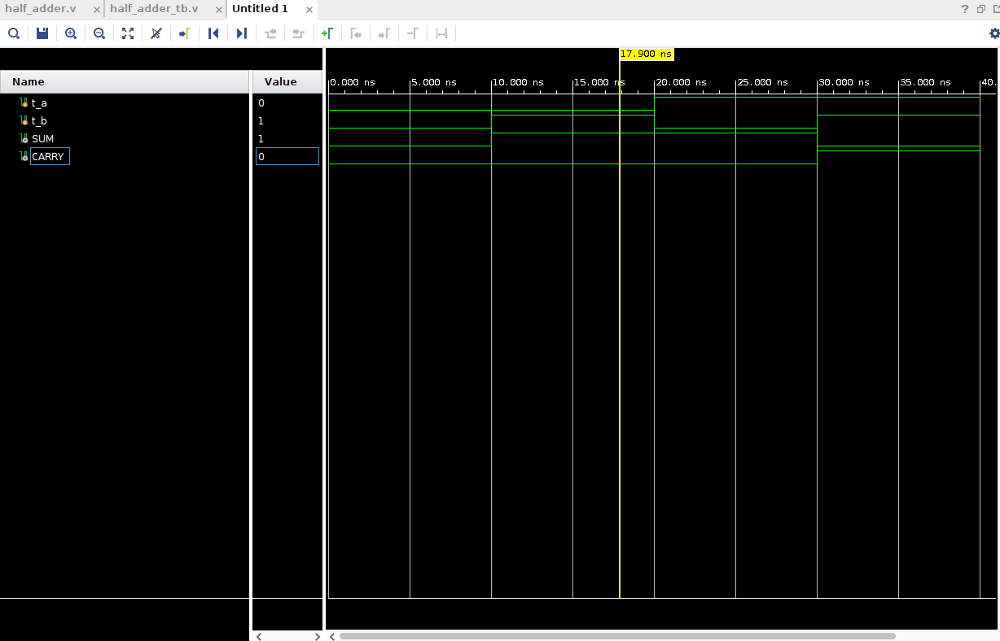
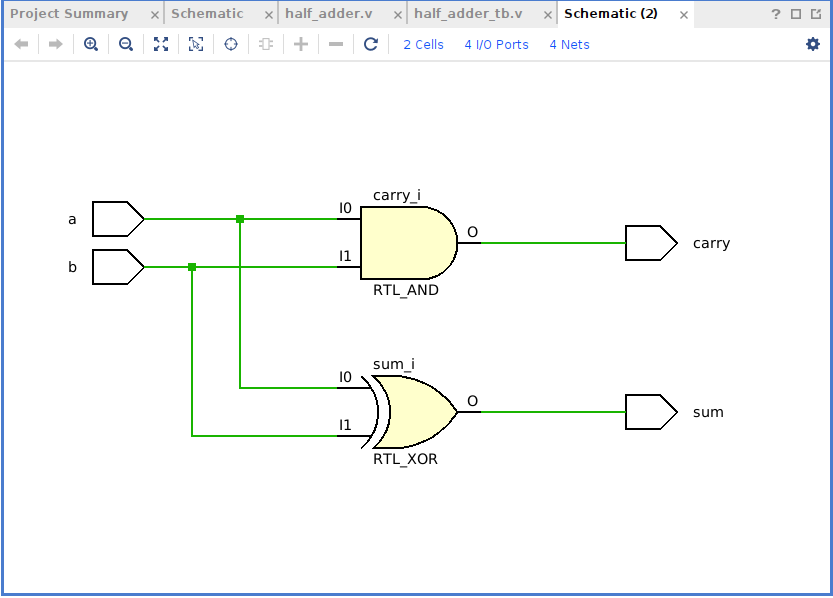

# Verilog simulation Tutorial

Requirements
Vivado Installation (Currently using Vivado 2021.2)

Hardware:
ZCU111

### Creating from scratch

Start up a Vivado session. Choose create project and add ZCU111 as FPGA board.

To add a verilog file select AddSources->Add or Create design sources. On the next page select 'Create File'. Use Verilog File type and use <b>half_adder</b> for the file name. On the Define Module window you can add the ports here or in the text editor. Click Ok to complete the creation of the verilog. In the sources panel you should see the verilog file you created. You can double click on this to pull it up in an editor. To add a Test Bench file to test the verilog code you add select AddSources->Add or create simulation sources, for the file name use <b>half_adder_tb</b>

Edit the <b>half_adder.v</b> with the following code:

`verilog`

```
    module half_adder(a,b,sum,carry);
    input a,b;
    output sum,carry;
    assign sum=a^b;
    assign carry=a&b;
    endmodule
```


Add the following to the test bench code <b>half_adder_tb.v</b>:

```
    module half_adder_tb();
    reg t_a,t_b;
    wire SUM,CARRY;
    half_adder dut(.a(t_a),.b(t_b),.sum(SUM),.carry(CARRY));
    initial begin
    t_a =0;t_b=0;
    #10
    t_a =0;t_b=1;
    #10
    t_a =1;t_b=0;
    #10
    t_a =1;t_b=1;
    #10
    $stop;
    end
    endmodule
```

After editing the files you can run SIMULATION->Run Simulation and a waveform window will open. To see the waveform you may have to zoom in. Every 10 ns of the waveform the inputs and outputs will change.



To view the RTL schematic of the diagram you can click on RTLAnalysis->Open Elaborated Design->Schematic


